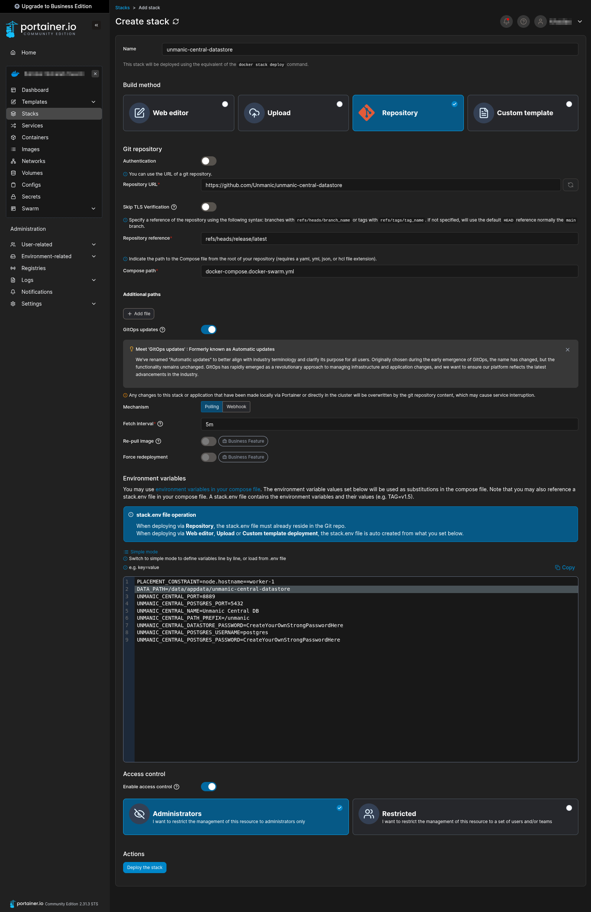

# Docker Compose Releases

Here are the latest published Docker Compose stack for self-hosting this project.

These can be deployed on either Docker or Docker Swarm.

## Table of contents

1. [Deploy With Compose from terminal](#deploy-with-compose-from-terminal)
1. [Deploy on Swarm with Portainer](#deploy-on-swarm-with-portainer)

## Deploy With Compose from terminal

### First time

1. Clone this repo
   ```
   git clone https://github.com/Unmanic/unmanic-central-datastore
   ```
2. Checkout the latest release branch `release/latest`.
   ```
   git checkout release/latest
   ```
3. Copy `docker-compose.docker.env.example` to `.env`
   ```
   cp -fv ./docker-compose.docker.env.example  ./.env
   ```
4. Edit the `.env` file as required
5. Create the directory you have configured as your `DATA_PATH`
   ```
   mkdir -p $(grep '^DATA_PATH=' .env | cut -d= -f2-)/postgresql
   ```
6. Start stack with `docker compose` or `podman compose`
   ```
   sudo docker compose -f ./docker-compose.docker.yml up
   ```

### Updating

To update, simply pull the latest changes from `release/latest` and run step 5 again.
As this is a single-commit branch, you can run this command below to always fetch the latest changes.

```
git fetch origin release/latest && git reset --hard FETCH_HEAD
```

It would be good to check from time-to-time if the `docker-compose.docker.env.example` has been updated with new config variables.

## Deploy on Swarm with Portainer

### Adding a stack

In the environment, add a new stack following these steps:

1. Name the stack according the the docker-compose YAML file name in this repo.
1. Configure the stack to pull from a git repository.
1. Enter in the details for this repo.
   - Repository URL: `https://github.com/Unmanic/unmanic-central-datastore`
   - Repository reference: `refs/heads/release/latest`
1. Enter the name of the the docker-compose YAML file (`docker-compose.docker-swarm.yml`).
1. Enable GitOps updates.
1. Configure Polling updates with an interval of `5m`.
1. Configure Environment Variables. Refer to the [docker-compose.docker-swarm.env.example](./docker-compose.docker-swarm.env.example) file. Copy their contents into Portainer's **Environment variables** section (toggled to "Advanced mode") and edit as required.

> [!IMPORTANT]
> You will need to create the `DATA_PATH` on the host you choose prior to deploying.
> This will also need to be configured as an absolute path.
> Ensure you configure the `*_PLACEMENT_CONSTRAINT` variables to fix the service to the host with the `DATA_PATH` path.


